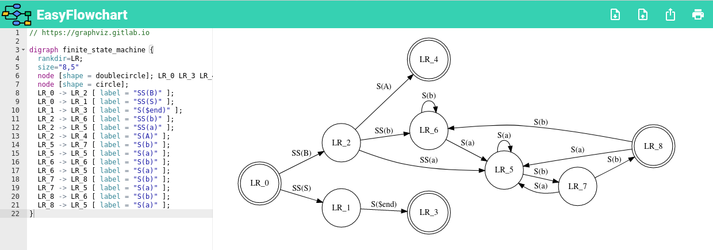

<p align="center">
  <br/>
  <i>Online Graphviz editor.</i><br/><br/>
</p>

[**Online Editor**](https://sorieux.github.io/easyflowchart/)

[](https://sorieux.github.io/easyflowchart/)

## Development


```bash
# Project setup
npm install

# Compiles and hot-reloads for development
npm run serve

# Compiles and minifies for production
npm run build

# Run your unit tests
npm run test:unit

# Lints and fixes files
npm run lint
```

## Questions and Contributions

Contributions are very welcome, as are feature requests and suggestions. Please open an [issue](https://github.com/sorieux/easyflowchart/issues) if you encounter any problems.
